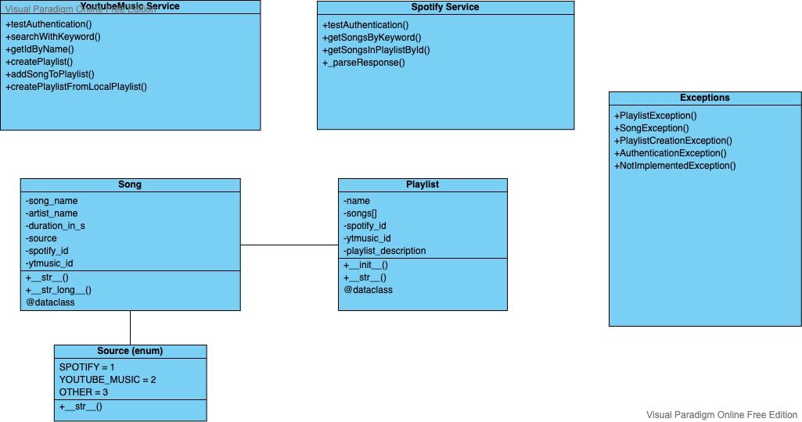

# SpoToYou
This application can convert a Music-Playlist from Spotify to a YouTube-Music Playlist, as there is no official service for that. Therefore it loops over the Spotify-Playlist, searches for each song on YouTube-Music and adds the song to a new playlist.

# used and mandatory Packages
 - pyfiglet for fancy console text
 - dotenv for environment variables
 - spotipy as spotify api/sdk
 - ytmusicapi as api/sdk for youtube music
 - click for a better cli experience
 - colorama for a better looking console

# Prerequisites
## 1.  Installation & virtual Environment

Create virtual environment and install all the needed packages from requirements.txt as follows:

```
    python3 -m venv ./venv
```

```
    venv\bin\activate
```

```
    pip3 install -r requirements.txt
```
## 2. Environment Variables for Spotify
file for env vars needs to be created, currently named "variables.env".
currently follows this structure:
```
CLIENT_ID=xxxxxxxxxxxxxxxxxxxxxxxxxxxxxxxx
CLIENT_SECRET=xxxxxxxxxxxxxxxxxxxxxxxxxxxxxxxx
 ```
*secret & id are for spotify authentication and can be created at [Spotify Developer Portal](https://developer.spotify.com/dashboard/applications)*
## 3. Authentication Header for YT-Music
file for YT music authentication needs to be created in /services called "headers_auth.json".
currently follows this structure:
```
{
    "User-Agent": "Mozilla/5.0 (Windows NT 10.0; Win64; x64; rv:72.0) Gecko/20100101 Firefox/72.0",
    "Accept": "*/*",
    "Accept-Language": "en-US,en;q=0.5",
    "Content-Type": "application/json",
    "X-Goog-AuthUser": "0",
    "x-origin": "https://music.youtube.com",
    "Cookie" : "paste your own cookie here"
}
```
[click here to learn more about how to get your own YTMusic Cookies](https://ytmusicapi.readthedocs.io/en/latest/setup.html#manual-file-creation)
###Attention: Cookie might be longer than the capacity of the clipboard (to copy, so make sure its copied completely (maybe in 2 parts)

# USAGE
## Spotify to Youtube Music
This is a CLI (Command Line Interface)-Tool so there is no GUI at all. It's completely controlled via the terminal.
Sofar there is only the option to convert a Spotify Playlist to a Youtube Music Playlist. First of all, make sure your playlist is set to PUBLIC as there is no Authentication towards individual spotify accounts yet. The command is as follows:
```
$venv python3 main.py ytm {ID of the Spotify Playlist}
```
There are two optional parameters:
```
-n / --name to set a new for the new Playlist. If not defined, origin playlists name will be used
-d / --description to fill out a Description for the playlist. If not defined, It'll be blank as its not mandatory.
```
An example could look like this:
```
$venv python3 main.py ytm 3guAfgfqBXolcknhXwNSeT -n CooleLieder -d Beschreibung
```

## Spotify to Apple Music
NOT IMPLEMENTED YET
```
$venv python3 main.py am
```

# Technical Details and Structure
No Tests (yet), as there is no real business logic to test. Tbc
## Entity Relationship Diagram

## Class Diagram

## Programm Ablauf Plan

