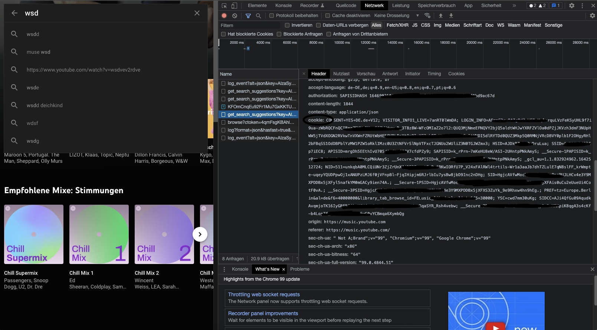

# Guide on how to get your Youtube-Music Authentication Cookie
## 1.
Navigate to [Youtube Music](https://www.music.youtube.com) and log in with your Google Account (if not already logged in)
## 2.
Open the Developer Tools in your Browser and switch to "Network Analysis"
## 3.
Type something into the search bar and look for the network traffic. You need to find a POST-Request.
## 4.
Scroll down to the section of Requestheader (Anfrageheader) and copy the Value of field "Cookie" (shown in the picture):

Attention: Make sure to copy the whole cookie, for some OS there is a limit of "copy capacity", so check manually if the end of the copied value is identical.
## Thats it, now go on with the normal tutorial